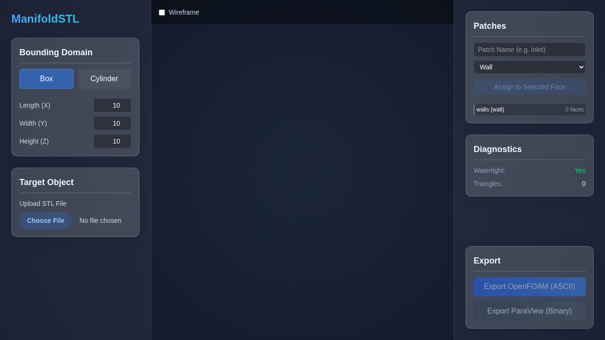

# ManifoldSTL



A browser-based, parameterized geometry generator designed specifically for Computational Fluid Dynamics (CFD) workflows. It allows engineers to automatically generate, validate, and export "simulation-ready" bounding domains with predefined boundary patches, specifically optimized for OpenFOAM (`snappyHexMesh` / `cfMesh`) and Siemens Star-CCM+ / ParaView.

## Getting Started

First, run the development server:

```bash
npm run dev
# or
yarn dev
```

Open [http://localhost:3000](http://localhost:3000) with your browser to see the result.
